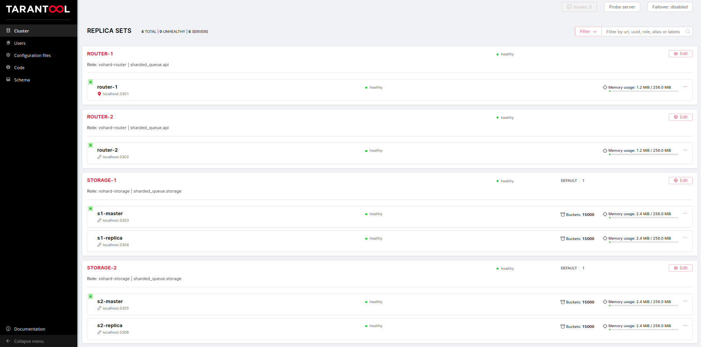

# sharded-queue-performance
Нагрузочное тестирование шардированной очереди на базе Tarantool + Cartridge с использованием Pandora + Yandex.Tank

## Сборка пушки

1. Если go есть в системе:
    ```shell
    go get github.com/tarantool/go-tarantool \
           github.com/spf13/afero            \
           github.com/yandex/pandora
    
    go build tnt_queue_gun.go
    ```
2. Если go нет в системе, но есть докер:
    ```shell
    ./build.sh
    ```

## Подготовка среды для приложения

Необходимые компоненты для установки и работы нашего приложения: tarantool и cartridge-cli.
Инструкцию по установке можно найти [тут](https://github.com/tarantool/cartridge-cli#installation).

В случае успеха перейдем в директорию с приложением и установим зависимости:
```
cd queue-app
tarantoolctl rocks make
```

## Запуск приложения и конфигурация кластера

Для запуска инстансов кластера:
```
cartridge start
```

Конфигурацию кластера выполним скриптом bootstrap.lua:
```
tarantool bootstrap.lua
```

В случае успеха, по адресу [localhost:8081](localhost:8081) в браузере будет видная следующая конфигурация кластера:


## Создание очереди для тестирования

В терминах sharded-queue экземпляр очереди - труба (tube). Создать ее можно, как через бинарное апи, так и через конфигурацию кластера. Воспользуемся вторым методом.

Перейдем во вкладку [code](http://localhost:8081/admin/cluster/code) в левом меню веб морды.
В редакторе кода создадим файл `tubes.yml` в который поместим конфигурацию интересующей нас очереди:
```yaml
test-tube:
    temporary: false
    driver: sharded_queue.drivers.fifo
```


Остается нажать кнопку *Apply* и дождаться сообщения об успешном выполнении операции.

## Запуск нагрузочного тестирования

```
cd ..

docker run -v $(pwd):/var/loadtest      \
           -v $SSH_AUTH_SOCK:/ssh-agent \
           -e SSH_AUTH_SOCK=/ssh-agent  \
           --net host                   \
           -it direvius/yandex-tank
```
NOTE

Для docker for mac может понадобиться заменить `localhost` на алиас `host.docker.internal` в файле [tnt_queue_load.yaml](./tnt_queue_load.yaml).


Более детальную информацию про установку и настройку Yandex.Tank можно найти в [документации](https://yandextank.readthedocs.io/en/latest/install.html).

